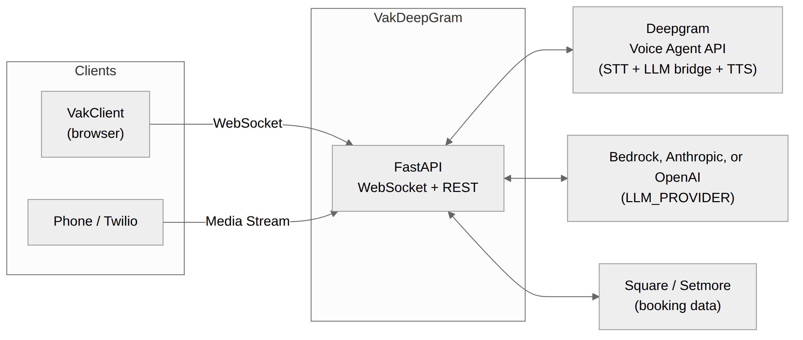

# Vak — Voice Assistant Kit

Vak is a complete, self-hostable platform for building AI voice and chat
assistants for service businesses — barbers, salons, spas, clinics, gyms,
home services, or anything in between. Customers call, text, chat, or talk
in the browser; a real-time voice agent answers questions, checks
availability, and books appointments through Square or Setmore.

It ships as three parts that deploy independently but work as one system:

| Component | What it is | Stack |
|---|---|---|
| [`VakClient`](./VakClient/) | Web voice + chat UI | React, Vite, TypeScript |
| [`VakDeepGram`](./VakDeepGram/) | Real-time voice agent server | FastAPI, Python, Strands Agents |
| [`VakInfra`](./VakInfra/) | AWS deployment (CDK) | AWS CDK v2, TypeScript |

Everything is driven by one interactive setup wizard — no manual `.env`
editing required to get started.



## Quick start

You need [Node.js 20+](https://nodejs.org), [Python 3.8+](https://python.org),
and a free [Deepgram API key](https://console.deepgram.com). Docker and the
AWS CLI are only needed if you deploy to AWS.

```bash
git clone <this-repo>
cd VakVoiceAssistant

./vak init      # interactive setup — business profile, Deepgram key, etc.
./vak dev       # runs VakDeepGram + VakClient locally
```

Open [http://localhost:5173](http://localhost:5173), click **Connect**, then
**Start Conversation** and talk to your agent. That's it — `./vak init`'s
"local test mode" runs a mock business with no Square/Setmore account
required, so you can hear it working in under two minutes.


Full walkthrough with more screenshots: [docs/TUTORIAL.md](./docs/TUTORIAL.md).

Run `./vak doctor` any time to check your environment, or `./vak help` to
see all commands.

## Deploying to AWS

```bash
./vak deploy
```

This walks you through `cdk bootstrap` and `cdk deploy`, prompting for
confirmation before touching your AWS account. It provisions a VPC, ECR
repo, ECS Fargate service, ALB, DynamoDB tables, and an S3 bucket — no
existing AWS infrastructure required. Custom domains, TLS, WAF API-key
protection, and Cognito auth are all optional add-ons layered on top; see
[VakInfra/README.md](./VakInfra/README.md) for the full reference and
[docs/DEPLOYMENT.md](./docs/DEPLOYMENT.md) for a guided walkthrough.

## Documentation

| Doc | What's in it |
|---|---|
| [docs/TUTORIAL.md](./docs/TUTORIAL.md) | **Start here.** A short, screenshot-illustrated walkthrough to your first conversation |
| [docs/GETTING_STARTED.md](./docs/GETTING_STARTED.md) | The same journey in more depth, with every wizard question explained |
| [docs/CONFIGURATION.md](./docs/CONFIGURATION.md) | Full environment variable reference for all three components |
| [docs/CUSTOMIZING_YOUR_AGENT.md](./docs/CUSTOMIZING_YOUR_AGENT.md) | Give the agent a business name, pick a vertical, or write your own persona |
| [docs/DEPLOYMENT.md](./docs/DEPLOYMENT.md) | Deploying to AWS, step by step |
| [docs/TWILIO.md](./docs/TWILIO.md) | Connecting a real phone number, and the security model behind it |
| [docs/ARCHITECTURE.md](./docs/ARCHITECTURE.md) | Module-level technical reference, with diagrams |
| [docs/DESIGN.md](./docs/DESIGN.md) | System design and the reasoning behind it |
| [docs/FAQ.md](./docs/FAQ.md) | Common problems and fixes |
| [VakClient/README.md](./VakClient/README.md) | Frontend-specific setup |
| [VakDeepGram/README.md](./VakDeepGram/README.md) | Backend-specific setup and API reference |
| [VakInfra/README.md](./VakInfra/README.md) | Infrastructure reference |

## Features

- **Real-time voice** — bidirectional audio streaming over WebSocket, with barge-in support
- **Any use case** — a general assistant by default; built-in persona presets for barber, salon, spa, medical, fitness, and home services, or write your own (see [docs/CUSTOMIZING_YOUR_AGENT.md](./docs/CUSTOMIZING_YOUR_AGENT.md))
- **Pick your AI model** — AWS Bedrock (Claude), Anthropic, or OpenAI for conversation and tool-calling; Deepgram, ElevenLabs, or any other Deepgram-supported voice for speech (see [docs/CONFIGURATION.md](./docs/CONFIGURATION.md))
- **AI agent with tools** — Strands Agents, with callable tools for hours, services, staff, availability, and booking
- **Two booking providers** — Square and Setmore, behind a common tool interface
- **Phone support** — Twilio Media Streams for inbound/outbound calls, plus SMS and WhatsApp
- **Text chat** — a REST `/chat` endpoint and a web chat UI, sharing the same agent and tools as voice
- **One-command AWS deployment** — a single CDK app with no required external dependencies

## Project structure

```
.
├── vak                     # CLI entry point (./vak init | dev | deploy | doctor)
├── cli/                    # CLI implementation
├── VakClient/              # React + Vite frontend
├── VakDeepGram/             # FastAPI voice agent backend
├── VakInfra/                # AWS CDK infrastructure
├── docs/                    # Guides, tutorials, architecture
└── .github/workflows/       # CI/CD (deploy on push to main)
```

## Contributing

Issues and PRs welcome. See [AGENTS.md](./AGENTS.md) for repo conventions
(directory layout, coding style, commit/PR expectations).

## License

ISC — see [LICENSE](./LICENSE).
