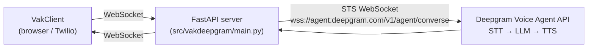

# VakDeepGram

Python-based FastAPI WebSocket server for Deepgram Voice Agents using STS (Secure Token Service).

This implementation uses the [Deepgram Voice Agent API](https://developers.deepgram.com/docs/voice-agent) via direct WebSocket connection with STS authentication (similar to sts-twilio pattern). The Voice Agent API combines speech-to-text (STT), large language model (LLM) processing, and text-to-speech (TTS) into a single WebSocket connection.

## Features

- 🚀 FastAPI with async WebSocket support
- 🎙️ Deepgram Voice Agents API via STS WebSocket connection
- 🔌 Real-time bidirectional audio streaming
- ⚙️ Configurable via environment variables
- 🎯 Supports multiple concurrent Voice Agent sessions
- 🔄 Automatic session management and cleanup
- 🔐 STS authentication using API key as subprotocol

## Installation

1. Create a virtual environment:
```bash
python -m venv venv
source venv/bin/activate  # On Windows: venv\Scripts\activate
```

2. Install dependencies:
```bash
pip install -r requirements.txt
```

3. Configure environment:
```bash
cp .env.example .env
# Edit .env with your Deepgram credentials
```

## Configuration

Set the following environment variables in `.env`:

```bash
# Required
DEEPGRAM_API_KEY=your_api_key
DEEPGRAM_PROJECT_ID=your_project_id

# AI model for /chat and voice tool-calling (separate from Deepgram's own
# STT/TTS). Options: bedrock (default, uses AWS credentials), anthropic, openai.
LLM_PROVIDER=bedrock
# ANTHROPIC_API_KEY=   # if LLM_PROVIDER=anthropic
# OPENAI_API_KEY=      # if LLM_PROVIDER=openai

# Optional - Agent Configuration
# If DEEPGRAM_AGENT_ID is not provided, a new agent will be created automatically
# using the settings below. If provided, the pre-configured agent will be used.
DEEPGRAM_AGENT_ID=your_agent_id  # Optional: Leave empty to create agent dynamically

# Optional - Server Configuration
HOST=0.0.0.0
PORT=8080
LOG_LEVEL=debug

# Optional - Voice Agent Configuration
DEEPGRAM_AGENT_LANGUAGE=en
DEEPGRAM_LISTENING_MODEL=flux-general-en
DEEPGRAM_LISTENING_VERSION=v2
DEEPGRAM_THINKING_PROVIDER=google
DEEPGRAM_THINKING_MODEL=gemini-2.5-flash

# Speaking/TTS Configuration
# "eleven_labs" (default) and "deepgram" are first-class; any other value
# Deepgram's Voice Agent API supports (e.g. "cartesia") passes through generically.
DEEPGRAM_SPEAKING_PROVIDER=eleven_labs
# For ElevenLabs:
DEEPGRAM_SPEAKING_MODEL_ID=eleven_multilingual_v2
DEEPGRAM_SPEAKING_VOICE_ID=cgSgspJ2msm6clMCkdW9
# For Deepgram TTS (if DEEPGRAM_SPEAKING_PROVIDER=deepgram):
# DEEPGRAM_SPEAKING_MODEL=aura-2-odysseus-en

DEEPGRAM_INPUT_SAMPLE_RATE=48000
DEEPGRAM_OUTPUT_SAMPLE_RATE=24000

# Optional: business profile and fallback greeting
BUSINESS_NAME=
BUSINESS_VERTICAL=generic
# DEEPGRAM_AGENT_GREETING=Hello! How may I help you?
```

The system prompt itself isn't a raw env var — it's generated from
`BUSINESS_NAME` / `BUSINESS_VERTICAL` (or a full `BUSINESS_ROLE_DESCRIPTION`
override). See [../docs/CUSTOMIZING_YOUR_AGENT.md](../docs/CUSTOMIZING_YOUR_AGENT.md).

**Note**: 
- **Option 1 (Recommended)**: Leave `DEEPGRAM_AGENT_ID` empty or unset. The agent will be created automatically using the configuration settings below.
- **Option 2**: Provide a pre-created `DEEPGRAM_AGENT_ID` from the Deepgram Console to use an existing agent.

The agent configuration (listening model, thinking provider, speaking provider, prompt, etc.) is defined in the environment variables below and will be used when creating agents dynamically.

**Default Configuration:**
- **Listening**: Deepgram Flux (flux-general-en, v2)
- **Thinking**: Google Gemini 2.5 Flash
- **Speaking**: ElevenLabs (eleven_multilingual_v2) with voice ID `cgSgspJ2msm6clMCkdW9`
- **Prompt**: Pre-configured virtual assistant prompt (see `config.py` for details)
- **Greeting**: "Hello! How may I help you?"

## Deployment to AWS ECR

To deploy the container to AWS ECR for use with VakInfra:

```bash
# Deploy to ECR
./deploy-to-ecr.sh

# Or with custom tag
IMAGE_TAG=v1.0.0 ./deploy-to-ecr.sh
```

**Note**: The ECR repository `vak-deepgram` will be created automatically if it doesn't exist. After pushing the image, deploy the VakAppStack in VakInfra to use the Deepgram container.

## Running the Server

### Option 1: Using Docker (Recommended)

**Quick start:**
```bash
# Start the server
./docker-run.sh

# Or start in background
./docker-run.sh up -d

# View logs
./docker-run.sh logs

# Stop the server
./docker-run.sh down
```

**On Windows:**
```cmd
docker-run.bat
docker-run.bat up -d
docker-run.bat logs
docker-run.bat down
```

**Available commands:**
- `./docker-run.sh` or `./docker-run.sh up` - Start server (foreground)
- `./docker-run.sh up -d` - Start server (background)
- `./docker-run.sh logs` - View logs
- `./docker-run.sh status` - Show container status
- `./docker-run.sh restart` - Restart server
- `./docker-run.sh down` - Stop server
- `./docker-run.sh rebuild` - Rebuild image
- `./docker-run.sh clean` - Clean up containers/volumes
- `./docker-run.sh help` - Show help

### Option 2: Direct Python

```bash
uvicorn vakdeepgram.api.main:app --host 0.0.0.0 --port 8080
```

Or with uvicorn directly:
```bash
uvicorn vakdeepgram.api.main:app --host 0.0.0.0 --port 8080 --reload
```

The server will start on `http://localhost:8080`

## Running the Test Client

### HTML Test Client

Open `test_client.html` in your browser. This provides full audio recording and playback capabilities for testing the WebSocket connection.

**Note**: For production use, use the VakClient React application which provides a full-featured interface.

## API Endpoints

### Endpoint Overview

| Endpoint | Protocol | Auth | Purpose |
|----------|----------|------|---------|
| `GET /` | HTTP | None | Health / version |
| `GET /health` | HTTP | None | Health check |
| `POST /chat` | HTTP | API key | Text chat |
| `POST /chat/oauth` | HTTP | Cognito JWT | Text chat (for an OAuth-authenticated companion app) |
| `POST /voice/oauth/connect` | HTTP | Cognito JWT | Get WebSocket URL for browser voice |
| `POST /twilio-chat` | HTTP | Twilio signature | Inbound SMS webhook |
| `POST /twilio/twiml` | HTTP | Twilio signature | Inbound voice call → returns `<Connect><Stream>` TwiML |
| `WebSocket /ws` | WS | Cognito JWT (optional) | Browser voice — this is what VakClient connects to |
| `WebSocket /twilio` | WS | Twilio signature | Twilio Media Streams (phone calls) |

The `/oauth` variants and Cognito JWT validation are only relevant if
you're fronting Vak with your own authenticated business dashboard; set
`OAUTH_JWKS_URL` / `OAUTH_ISSUER` / `OAUTH_AUDIENCE` to enable them (see
[../docs/CONFIGURATION.md](../docs/CONFIGURATION.md)). Without them, `/ws`
and `/chat` fall back to the `CHAT_API_KEY` / local dev checks.

### Multi-Tenant SMS & Voice Routing

Each business has a dedicated Twilio phone number stored in the
`BusinessNumber` DynamoDB table. Both inbound SMS and inbound voice calls
are routed to the correct business's AI agent based on the `To` number:

```
Inbound SMS:   Twilio → POST /twilio-chat  {To, From, Body}
                         └─ lookup BusinessNumber by To
                         └─ resolve Square/Setmore context
                         └─ AI agent (Strands) → reply SMS

Inbound Voice: Twilio → POST /twilio/twiml  {To, From, ...}
                         └─ return <Connect><Stream url="wss://.../twilio?phone={To}"/>
               Twilio → WSS /twilio
                         └─ start event: customParameters.businessNumber
                         └─ resolve Square/Setmore context
                         └─ Deepgram Voice Agent answers
```

See [`docs/SMS_MULTI_NUMBER_PLAN.md`](docs/SMS_MULTI_NUMBER_PLAN.md) for the full multi-number implementation plan.

### WebSocket: `/ws`

Connect to this endpoint for real-time audio streaming.

**Messages from client:**

1. Start recording:
```json
{ "action": "start-recording" }
```
(`start-deepgram` is accepted as a legacy alias.)

2. Stop recording:
```json
{ "action": "stop-recording" }
```
(`stop-deepgram` is accepted as a legacy alias.)

3. Audio data: Send binary PCM16 audio at 48kHz

**Messages to client:**

1. `welcome`: Welcome message from the agent (if configured)
2. `message-id`: New conversational turn started — pair subsequent messages by this ID
3. `partial-transcript`: Live user transcript (not yet final)
4. `transcript`: Final user transcript for this turn
5. `llm-token`: Streaming LLM response tokens
6. `llm-response`: Complete LLM response text
7. `tts`: Base64-encoded TTS audio chunk (24kHz PCM16)
8. `ready-to-listen`: Agent finished speaking and is ready for next input
9. `user-started-speaking`: Triggers client-side barge-in (stop TTS playback)
10. `agent-started-speaking`: Agent has begun producing audio
11. `deepgram-ready` / `settings-applied` / `deepgram-disconnected`: session lifecycle events
12. `error`: Error message

All messages include a `connectionId` field to identify the session. See
[../VakClient/README.md](../VakClient/README.md#websocket-protocol) for the
client-side view of this same protocol.

### REST Endpoints

- `GET /`: Service info
- `GET /health`: Health check

## Audio Format

- **Input**: PCM16, 48kHz, mono
- **Output**: PCM16, 24kHz, mono (when using Deepgram TTS) or varies (when using ElevenLabs)

## TTS Providers

### ElevenLabs (Default)
- **Provider**: `eleven_labs`
- **Model**: `eleven_multilingual_v2`
- **Voice ID**: `cgSgspJ2msm6clMCkdW9` (configurable)
- High-quality, natural-sounding voice synthesis
- Supports multiple languages

### Deepgram TTS (Alternative)
- **Provider**: `deepgram`
- **Model**: `aura-2-odysseus-en` (or other Aura models)
- Native integration with Deepgram services

### Any other provider Deepgram supports
Set `DEEPGRAM_SPEAKING_PROVIDER` to any other value Deepgram's Voice Agent
API accepts (e.g. `cartesia`) — it's passed through generically using
`DEEPGRAM_SPEAKING_MODEL_ID` / `DEEPGRAM_SPEAKING_MODEL` /
`DEEPGRAM_SPEAKING_VOICE_ID`. See `deepgram_handler.py`'s `_build_settings`.

## Architecture



See [../docs/ARCHITECTURE.md](../docs/ARCHITECTURE.md) for the full
system-level diagram and data model.

## Development

### Project structure

```
VakDeepGram/
├── src/vakdeepgram/
│   ├── main.py               # FastAPI server, WebSocket + REST endpoints
│   ├── deepgram_handler.py    # Deepgram Voice Agent session handler (STS WebSocket)
│   └── config.py               # Settings (business profile, Deepgram, AWS, ...)
├── providers/                  # Square/Setmore tools, prompts, and clients
├── services/, repositories/, utils/
├── scripts/                     # Seeding, verification, manual test scripts
├── tests/                        # pytest suite
├── test_client.html               # Minimal manual HTML test client
├── requirements.txt
└── .env.example
```

See [docs/PROJECT_STRUCTURE.md](docs/PROJECT_STRUCTURE.md) for the
in-progress layering migration, and
[../docs/ARCHITECTURE.md](../docs/ARCHITECTURE.md) for the full module
reference.

**Note**: `deepgram_handler.py` connects directly to the Deepgram Voice Agent WebSocket API using STS (Secure Token Service) authentication. The API key is passed as a WebSocket subprotocol, following the same pattern as the sts-twilio reference implementation.

## How It Works

The implementation follows the Deepgram Voice Agent STS (Secure Token Service) pattern:

1. **Connection**: Client connects to FastAPI WebSocket endpoint (`/ws`)
2. **Session Start**: Client sends `{"action": "start-deepgram"}` to initiate a Voice Agent session
3. **STS Connection**: Server creates a WebSocket connection to Deepgram Voice Agent API using:
   - Endpoint: `wss://agent.deepgram.com/v1/agent/converse`
   - Authentication: API key passed as WebSocket subprotocol `["token", api_key]`
   - No SDK required - direct WebSocket connection
4. **Settings**: Server sends Settings message as JSON with agent configuration (audio format, models, prompt, etc.)
5. **Audio Streaming**: 
   - Client sends PCM16 audio chunks (binary) → Server → Deepgram Voice Agent (as binary)
   - Deepgram processes: STT → LLM → TTS
   - Server receives TTS audio chunks (binary) → Client (as base64)
6. **Event Handling**: Server handles various JSON events:
   - Welcome: Initial greeting from agent
   - SettingsApplied: Confirmation that settings were applied
   - UserStartedSpeaking: User began speaking (triggers new message ID)
   - ConversationText: User transcript and agent responses
   - AgentThinking: Agent is processing
   - AgentStartedSpeaking: Agent began speaking
   - AgentAudioDone: Agent finished speaking
   - Error: Error messages
7. **Session End**: Client sends `{"action": "stop-deepgram"}` or disconnects

## Troubleshooting

### Connection Issues
- Verify Deepgram API key is set correctly in `.env`
- Check network connectivity to `agent.deepgram.com`
- Review server logs for STS connection errors
- Ensure API key has proper permissions for Voice Agents
- Verify WebSocket subprotocol authentication is working

### Audio Issues
- Verify microphone permissions in browser/client
- Check sample rate matches configuration (default: 48kHz input, 24kHz output)
- Ensure audio format is PCM16 (linear16)
- Verify audio chunks are being sent as binary data, not base64

### Import Errors
- Make sure all dependencies are installed: `pip install -r requirements.txt`
- Verify Python version (3.8+)
- Ensure `websockets` package is installed (version 12.0+)

### Voice Agent Issues
- Verify the agent is configured correctly in Deepgram Console
- Check that the listening model (e.g., `flux-general-en`) is available
- Ensure thinking provider (e.g., `google`) and model are valid
- Verify speaking model (e.g., `aura-2-odysseus-en`) is available
- Check API quotas and limits in Deepgram Console

## References

- [Deepgram Voice Agent Documentation](https://developers.deepgram.com/docs/voice-agent)
- [Deepgram Console](https://console.deepgram.com/)
- [STS Pattern Reference](https://github.com/deepgram/sts-twilio) - Similar implementation pattern

## License

ISC
