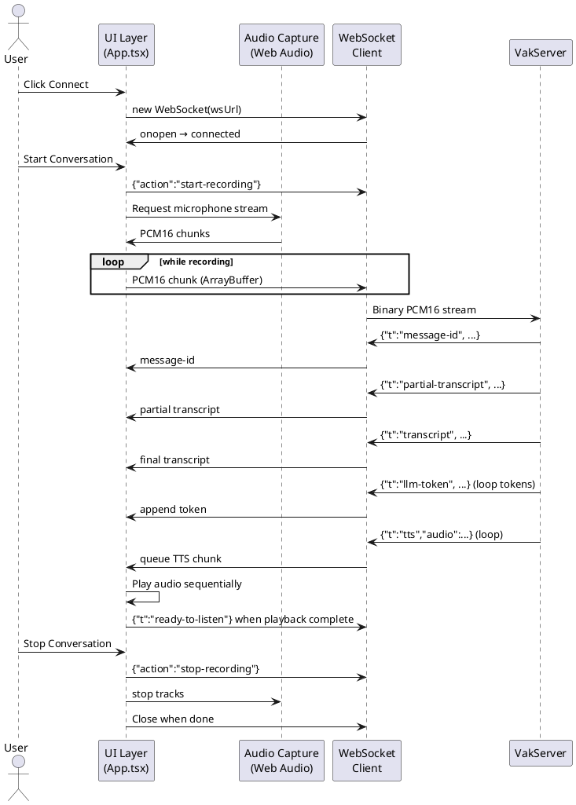
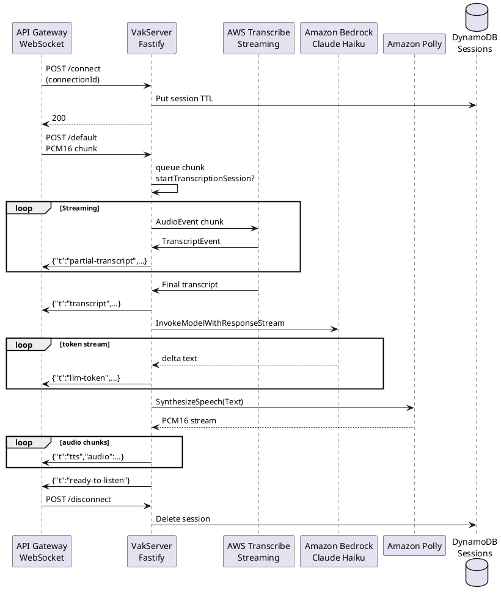

# Vak Voice Assistant Design

## Overview
- Streaming speech-to-speech and text assistant for real-time conversations.
- React client captures microphone audio, streams PCM16 over WebSocket, and renders live transcripts plus Polly playback.
- Fastify server orchestrates AWS Transcribe Streaming, Bedrock, and Polly to produce bi-directional audio/text responses.
- Infrastructure is deployed with AWS CDK to ECS Fargate behind an NLB and API Gateway WebSocket, with DynamoDB for session state.

## Goals
- Provide low-latency bidirectional voice and text interactions.
- Support both local development (direct WebSocket) and AWS production (API Gateway callbacks).
- Maintain conversational pairing using server-generated `messageId` identifiers.
- Allow per-session text-to-speech engine selection (Polly generative/neural/standard).

## Non-Goals
- Persisting conversation history beyond active session TTL.
- Implementing end-user identity or multi-tenant authorization beyond IAM-secured API Gateway.
- Offline transcription or fallback LLM/TTS models.

## System Architecture
- **Client (`VakClient`)**: Vite/React SPA with Web Audio API, manages WebSocket lifecycle, audio capture/playback, and UI status.
- **Edge**: API Gateway WebSocket (`$connect`, `$default`, `$disconnect`) forwards to Network Load Balancer (NLB).
- **Compute**: `VakServer` Fastify service running on ECS Fargate, handles WebSocket sessions (local mode) or API Gateway callbacks.
- **AI & Voice Services**: AWS Transcribe Streaming (PCM16 @ 16 kHz), Bedrock Claude 3 Haiku streaming, and Polly for synthesized speech.
- **State & Storage**: DynamoDB `Sessions` table with TTL, optional S3 artifacts bucket for transcripts/audio.
- **Infrastructure (`VakInfra`)**: CDK stack provisioning VPC, ECS service, IAM roles, NLB, API Gateway, and ECR repository.

## AWS Services Used End-to-End
- **Compute & Containers**: AWS Fargate on Amazon ECS for the Fastify workload; Amazon ECR for container image storage.
- **Networking & Connectivity**: Amazon VPC (public/private subnets, NAT Gateway), Elastic Load Balancing (Network Load Balancer), Amazon API Gateway WebSocket API, VPC Endpoint Service for private consumers.
- **AI & Voice**: Amazon Transcribe Streaming (speech-to-text), Amazon Bedrock (Claude 3 Haiku for LLM responses), Amazon Polly (text-to-speech engines: generative/neural/standard).
- **State & Storage**: Amazon DynamoDB (session store with TTL), Amazon S3 (artifacts bucket for transcripts/audio, optional persistence).
- **Security & Access Control**: AWS Identity and Access Management (IAM) roles/policies for ECS tasks, API Gateway IAM authorization; AWS STS leveraged for optional request validation.
- **Monitoring & Operations**: Amazon CloudWatch Logs via `awslogs` driver for ECS, CloudWatch metrics/alarms (planned) for API Gateway, NLB, and Fargate health.
- **Developer Tooling & Deployment**: AWS Cloud Development Kit (CDK) for infrastructure-as-code, AWS CLI for deployments and ECR pushes.

### Key Server Responsibilities
- Stream PCM16 audio to Transcribe, relay partial/final transcripts, and detect pauses.
- Invoke Bedrock with transcripts or text input, stream tokens to client.
- Synthesize full responses via Polly, chunk audio to client, and manage ready-to-listen signals.
- Track TTS preferences per connection and clean up DynamoDB session state on disconnect.

## Data Flows
1. **Text Interaction**
   - Client sends `{"action":"message","text":...}`.
   - Server calls Bedrock, streams tokens back as `llm-token` events.
   - Server generates Polly audio per response, streams as base64 PCM chunks, marks completion with `ready-to-listen`.

2. **Voice Interaction**
   - Client sends `start-recording`, streams PCM16 ArrayBuffers.
   - Server batches audio into Transcribe session, emits partial transcripts and final transcript tagged by `messageId`.
   - Final transcript triggers Bedrock + Polly sequence, mirroring text flow.
   - Client queues TTS audio by `messageId`, plays sequentially, then sends `ready-to-listen` after playback.

3. **Session Lifecycle**
   - On connect, server stores session in DynamoDB with 1-hour TTL; removed on disconnect or TTL expiry.
   - Local development uses in-process WebSocket handling; production uses API Gateway callbacks with ApiGatewayManagementApi responses.

## Deployment & Environments
- **Local Mode**: Enabled when `LOCAL_MODE=true` or `WS_API_ENDPOINT` absent; Fastify serves `/ws` endpoint directly.
- **AWS Mode**: API Gateway WebSocket with IAM authorization integrates with NLB -> Fargate; server uses `WS_API_ENDPOINT` for callbacks.
- **Infrastructure Highlights**:
  - VPC with public/private subnets, single NAT.
  - ECS Fargate task (512 MiB / 0.25 vCPU) with health checks on `/health`.
  - DynamoDB pay-per-request table, S3 artifacts bucket, IAM roles for Bedrock/Transcribe/Polly/execute-api.
  - Docker image built via CDK `DockerImageAsset` from `VakServer` directory.

## Security Considerations
- IAM authorization enforced on `$connect` route; Fastify middleware validates API Gateway headers and SigV4 presence.
- Task role scoped to required AWS services; artifacts bucket/dynamodb access limited to role.
- TLS termination at API Gateway; WebSocket clients use `wss://{api-id}.execute-api.{region}.amazonaws.com/prod`.

## Observability
- Fastify logger outputs structured logs for transcripts, speech synthesis, and errors.
- ECS task uses CloudWatch Logs (`streamPrefix=vak-server`).
- NLB health checks ensure container readiness.
- Future enhancements: CloudWatch alarms/dashboards, distributed tracing (e.g., AWS X-Ray), request metrics.

## Failure & Recovery
- Client retries audio chunk sends if WebSocket not ready; pause detection (1.5s silence) triggers processing.
- Server emits descriptive `t:error` messages on Transcribe/Polly failures.
- ECS auto-restarts unhealthy tasks; DynamoDB TTL cleans orphan sessions.
- Consider back-pressure or throttling when audio queue grows excessively.

## Open Questions
- Should transcripts/audio artifacts be persisted to S3 automatically for auditing?
- Need for explicit client authentication/authorization (e.g., Cognito) for multi-user scenarios?
- Strategy for handling Transcribe rate limits or buffering beyond current logging/warnings?
- Multi-region redundancy or disaster recovery requirements?

## Sequence Diagrams

### Client Conversation Flow

### Server Processing Flow

## Next Steps
- Add CloudWatch alarms and dashboards for latency, error, and throughput monitoring.
- Evaluate model flexibility (fallback models, dynamic selection).
- Integrate client authentication/authorization if required by product scope.
- Document scaling considerations (horizontal Fargate scaling, concurrency limits) and load testing plan.
