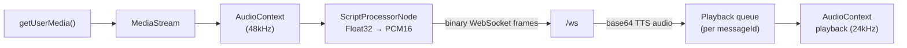
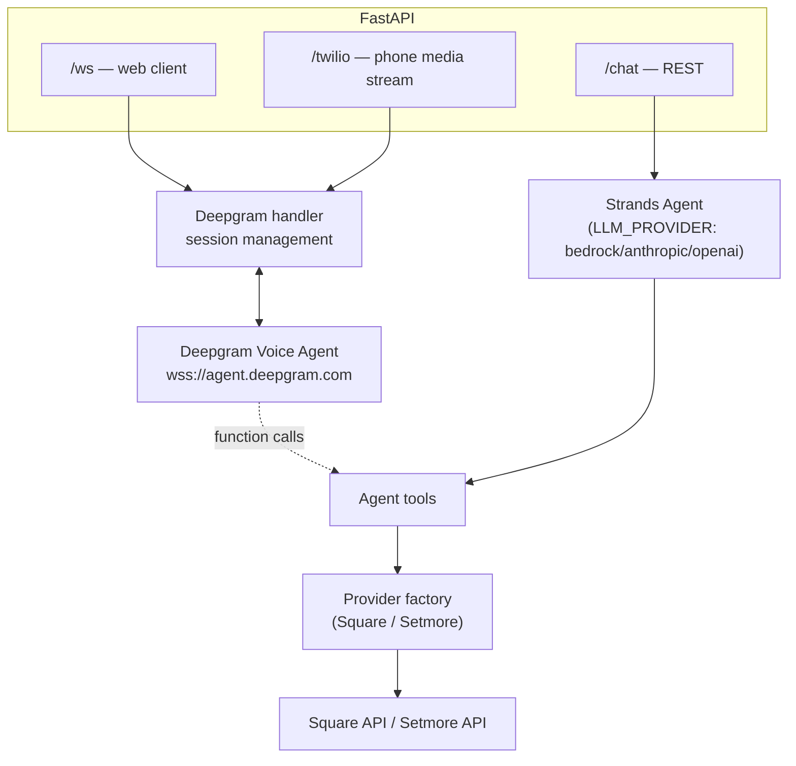
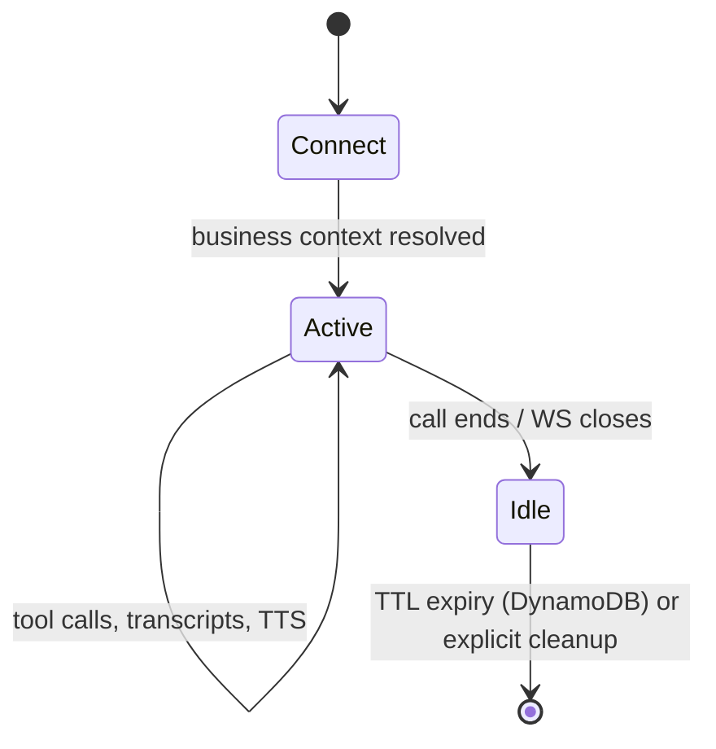
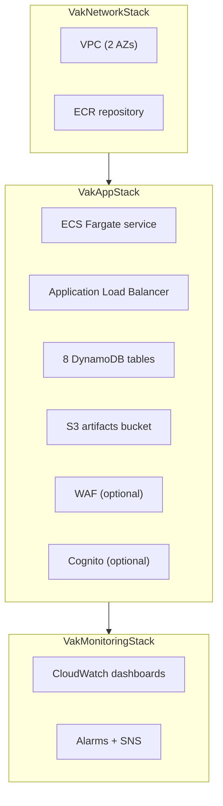
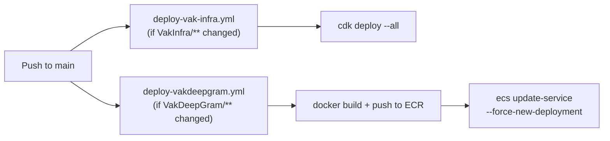

# Architecture

A code-level reference for how Vak is built. For the "why" behind these
choices, see [DESIGN.md](./DESIGN.md). For "how do I deploy this," see
[DEPLOYMENT.md](./DEPLOYMENT.md).

## Repository structure

```
.
├── vak                     # CLI entry point
├── cli/                    # CLI implementation (init/dev/deploy/doctor)
├── VakClient/               # React frontend
├── VakDeepGram/              # Python backend
├── VakInfra/                 # AWS CDK infrastructure
├── docs/                     # This directory
└── .github/workflows/        # CI/CD
```

## Technology stack

| Component | Technology |
|---|---|
| VakClient | React 18, Vite, TypeScript |
| VakDeepGram | FastAPI, Python, Strands Agents, Deepgram SDK |
| VakInfra | AWS CDK v2 (TypeScript) |
| LLM | AWS Bedrock (Claude, default), Anthropic, or OpenAI — via Strands Agents |
| Voice | Deepgram Voice Agent API (STT, LLM bridge, TTS) |
| Booking data | Square or Setmore |

## VakClient

### Structure

```
VakClient/src/
├── main.tsx           # Entry point
├── App.tsx            # Voice page
├── ChatPage.tsx        # Text chat page
├── Layout.tsx           # Shared header/nav
├── ws-signer.ts          # AWS SigV4 WebSocket signing (Cognito-authenticated deployments)
└── *.css
```

### Audio pipeline



The client captures raw PCM16 audio at 48kHz and streams it as binary
WebSocket frames; the server resamples as needed. TTS audio comes back
base64-encoded, queued per `messageId` so playback stays in order and can
be interrupted immediately on barge-in (the user starts talking while the
agent is still speaking).

### WebSocket protocol

```typescript
// Client → Server
{ action: 'start-recording' | 'stop-recording' }
// or binary PCM16 audio frames

// Server → Client
{
  type: 'welcome' | 'transcript' | 'partial-transcript' | 'llm-token'
      | 'llm-response' | 'tts' | 'ready-to-listen' | 'message-id'
      | 'user-started-speaking' | 'agent-started-speaking' | 'error',
  connectionId: string,
  messageId?: string,
  ...
}
```

Each conversational turn gets a server-generated `messageId`; the client
pairs the user's transcript with the agent's reply using it (see
`MessagePair` in `App.tsx`).

## VakDeepGram

### Module layout

The backend is mid-migration from a flat module layout to a layered
`src/vakdeepgram/` package — see
[`VakDeepGram/docs/PROJECT_STRUCTURE.md`](../VakDeepGram/docs/PROJECT_STRUCTURE.md)
for the migration plan. Both layers are live today:

```
VakDeepGram/
├── src/vakdeepgram/
│   ├── main.py                 # FastAPI app, routes, WebSocket handlers
│   ├── config.py                # Settings (business profile, Deepgram, AWS, ...)
│   ├── deepgram_handler.py       # Deepgram Voice Agent session management
│   ├── llm.py                     # Builds the Strands model for LLM_PROVIDER (bedrock/anthropic/openai)
│   ├── business_logic.py          # Booking/customer orchestration
│   ├── agent_functions.py          # Deepgram function-call tool definitions
│   ├── connection_store.py         # Per-connection context + business data resolution
│   ├── store_tools.py               # Tool helpers shared across providers
│   ├── api/                          # Thin facade: `vakdeepgram.api.main:app` re-exports `main.app`
│   ├── core/, domain/                 # Newer layered modules (in progress)
│   ├── repositories/, services/         # Newer layered modules (in progress)
│   └── security/oauth.py                 # JWT validation
│
├── providers/                # Provider abstraction (see below)
├── services/                  # auth_context_service, business_context_service
├── repositories/               # connection_context_repository
├── utils/                       # logging, metrics, phone/case helpers, S3 session storage
├── scripts/                      # Seeding, verification, and manual test scripts
└── tests/                         # pytest suite
```

### Request flow



### Provider abstraction

Square and Setmore are exposed behind a common tool interface
(`get_services`, `get_staff`, `check_availability`, `create_appointment`,
etc.), selected per-connection based on which provider the resolved
business account uses:

```python
# providers/__init__.py
def get_tools_for_provider(provider: str) -> list: ...
def get_voice_prompt_for_provider(provider: str) -> str: ...
def get_chat_prompt_for_provider(provider: str) -> str: ...
```

The prompts themselves (`providers/square/prompts.py`,
`providers/setmore/prompts.py`) share a booking-flow structure but differ
where the providers genuinely differ — Setmore can't create appointments
directly (it returns a prefilled booking link sent via SMS/WhatsApp),
Square books directly and supports rescheduling. Both build their opening
persona from `providers/common/persona.py` — see
[CUSTOMIZING_YOUR_AGENT.md](./CUSTOMIZING_YOUR_AGENT.md).

### Data model

DynamoDB tables VakDeepGram reads and writes (created by VakInfra's CDK
stack by default — see
[VakInfra/README.md](../VakInfra/README.md#bringing-your-own-tables) to
import existing tables instead):

| Table | Partition key | Sort key | Purpose |
|---|---|---|---|
| Sessions | `sid` | — | WebSocket/chat session state (TTL) |
| BusinessNumber | `phoneNumber` | — | Maps a business phone number to its provider account |
| SquareAccount | `userId` | `merchantId` | Square OAuth credentials per business |
| SetmoreAccount | `accountId` | `userId` | Setmore refresh/access tokens per business |
| BusinessAutomations | `merchantId` | `locationId` | Per-location voice/automation settings |
| CallRecord | `callId` | — | Per-call analytics (duration, outcome, tool calls, ...) |
| VoiceCustomer | `customerId` | — | Caller profile, upserted per call (`caller:<phone>:<businessNumber>`) |
| UserBookingLink | `customerPhone` | `createdAt` | Booking links sent via SMS/WhatsApp (TTL) |

### Session lifecycle



## VakInfra

### Stack hierarchy



One environment per deployment by default (`stage` defaults to
`production`); run `cdk deploy` again with a different `-c stage=` /
`-c stackName=` to stand up a second environment. See
[VakInfra/README.md](../VakInfra/README.md) for the full configuration
reference.

### Deployment pipeline



Both workflows are also runnable manually (`workflow_dispatch`) and via
`./vak deploy` / `VakDeepGram/deploy-to-ecr.sh` locally.

## Security model

| Layer | Mechanism |
|---|---|
| Transport | TLS via ALB (when a certificate is configured) |
| API auth | Bearer/API-key checks in FastAPI (`CHAT_API_KEY`, OAuth JWT validation) |
| Edge auth (optional) | WAF static API key, or Cognito hosted-UI login at the ALB |
| Phone webhooks | Twilio request signature validation |
| Rate limiting | Per-IP request and WebSocket connection limits (`slowapi`) |

## Observability

- **Logging**: structured, PII-redacting (`utils/logging.py`) — phone
  numbers, emails, and tokens are redacted from log output.
- **Metrics**: emitted via `utils/metrics.py`; the CDK-provisioned
  CloudWatch dashboards chart ECS CPU/memory, ALB latency/error rate, and
  Sessions table capacity.
- **Call analytics**: every call writes a `CallRecord` (duration, outcome,
  tool-call counts, booking success) for downstream analysis.
