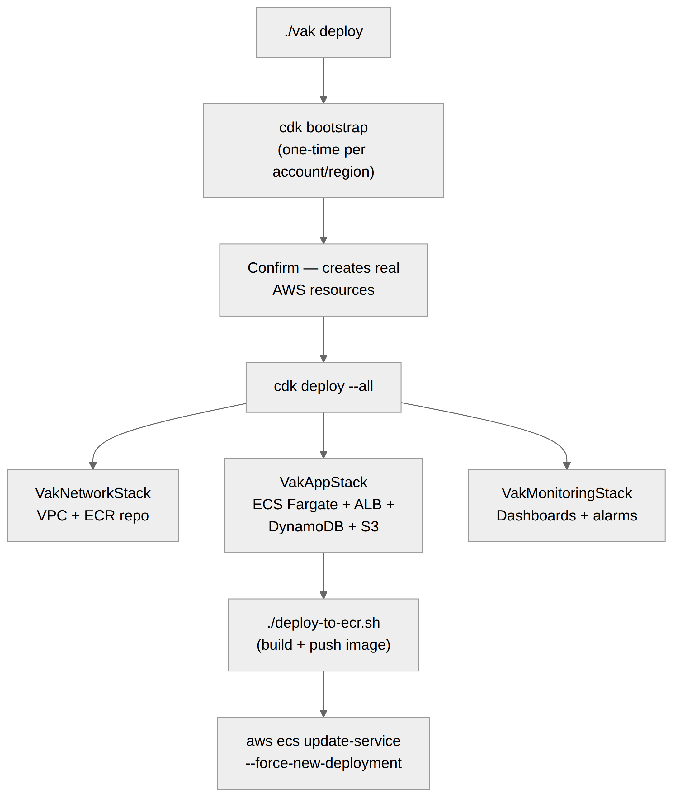

# Deploying to AWS

This is a guided walkthrough. For the full context/env-var reference, see
[VakInfra/README.md](../VakInfra/README.md).



## Prerequisites

- AWS CLI configured (`aws configure`, or SSO) with credentials for the
  target account
- Docker, for building the VakDeepGram image
- A Deepgram API key

## 1. Deploy the infrastructure

```bash
./vak deploy
```

This:

1. Checks your AWS credentials and installs `VakInfra`'s npm dependencies
   if needed.
2. Runs `cdk bootstrap` (safe to re-run — it's a no-op if already
   bootstrapped).
3. Shows you the target region and **asks for confirmation** before
   creating anything.
4. Runs `cdk deploy --all`, passing through whatever you configured in
   `VakInfra/.env` during `./vak init` (or set manually — see
   [VakInfra/README.md](../VakInfra/README.md#configuration)).

This provisions a VPC, ECR repository, ECS Fargate service, Application
Load Balancer, DynamoDB tables, and an S3 bucket — all from scratch, no
pre-existing AWS resources required.

## 2. Push the VakDeepGram image

`cdk deploy` creates the ECS service, but it doesn't have an image to run
yet on a first deploy. Build and push one:

```bash
cd VakDeepGram
./deploy-to-ecr.sh
```

Then force a new deployment so ECS picks it up:

```bash
aws ecs update-service \
  --cluster vak-cluster-production \
  --service <service-name> \
  --force-new-deployment
```

(Find `<service-name>` with `aws ecs list-services --cluster vak-cluster-production`.)

## 3. Point VakClient at it

`cdk deploy`'s output includes a `WebSocketUrl`. Set it in `VakClient/.env`:

```bash
VITE_WS_URL=wss://<your-alb-or-domain>/ws
```

Rebuild/redeploy `VakClient` (it's a static site — deploy the `dist/`
output from `npm run build` to S3+CloudFront, Amplify, Vercel, or wherever
you host static sites; this repo doesn't prescribe one).

## 4. Add a custom domain and TLS (optional)

If you already have a Route 53 hosted zone for your domain:

```bash
cd VakInfra
cdk deploy --all \
  -c deepgramApiKey=YOUR_KEY \
  -c domainName=voice.example.com \
  -c hostedZoneDomain=example.com
```

CDK creates a DNS-validated ACM certificate, an HTTPS listener, and the DNS
record automatically. See
[VakInfra/README.md](../VakInfra/README.md#custom-domain--tls) for details,
including using a pre-existing certificate instead.

## 5. Lock it down (optional)

- **WAF API key** — require an `X-Api-Key` header on every request:
  `-c apiKey=$(openssl rand -hex 32)`
- **Twilio-only access** — restrict the ALB to Twilio's IP ranges if the
  deployment only serves phone calls: `-c enableTwilioOnlyAccess=true`
- **Cognito auth** — gate `/ws` and `/chat` behind Cognito hosted-UI login
  at the ALB layer: `-c cognitoDomainPrefix=your-app-name`

See [VakInfra/README.md](../VakInfra/README.md#configuration) for the full
list. If you're connecting a real Twilio phone number, run `./vak twilio`
after deploying and see [docs/TWILIO.md](./TWILIO.md) for the full
security model (signature verification, credential handling, IP
allowlisting).

## Redeploying after a code change

- **Backend change**: `cd VakDeepGram && ./deploy-to-ecr.sh`, then force a
  new ECS deployment (step 2 above). The included GitHub Actions workflow
  (`.github/workflows/deploy-vakdeepgram.yml`) does this automatically on
  push to `main`.
- **Infra change**: `cd VakInfra && npx cdk deploy --all` with the same
  context flags you used originally. `.github/workflows/deploy-vak-infra.yml`
  does this automatically on push to `main` when `VakInfra/**` changes.

## Tearing it down

```bash
cd VakInfra
npx cdk destroy --all
```

The Sessions table and the S3 artifacts bucket are set to `DESTROY` on
stack deletion. The business-data tables (BusinessNumber, SquareAccount,
SetmoreAccount, BusinessAutomations, CallRecord, VoiceCustomer,
UserBookingLink) default to `RETAIN` so `cdk destroy` never silently
deletes real booking data — remove them manually via the DynamoDB console
if you're sure you want them gone.
