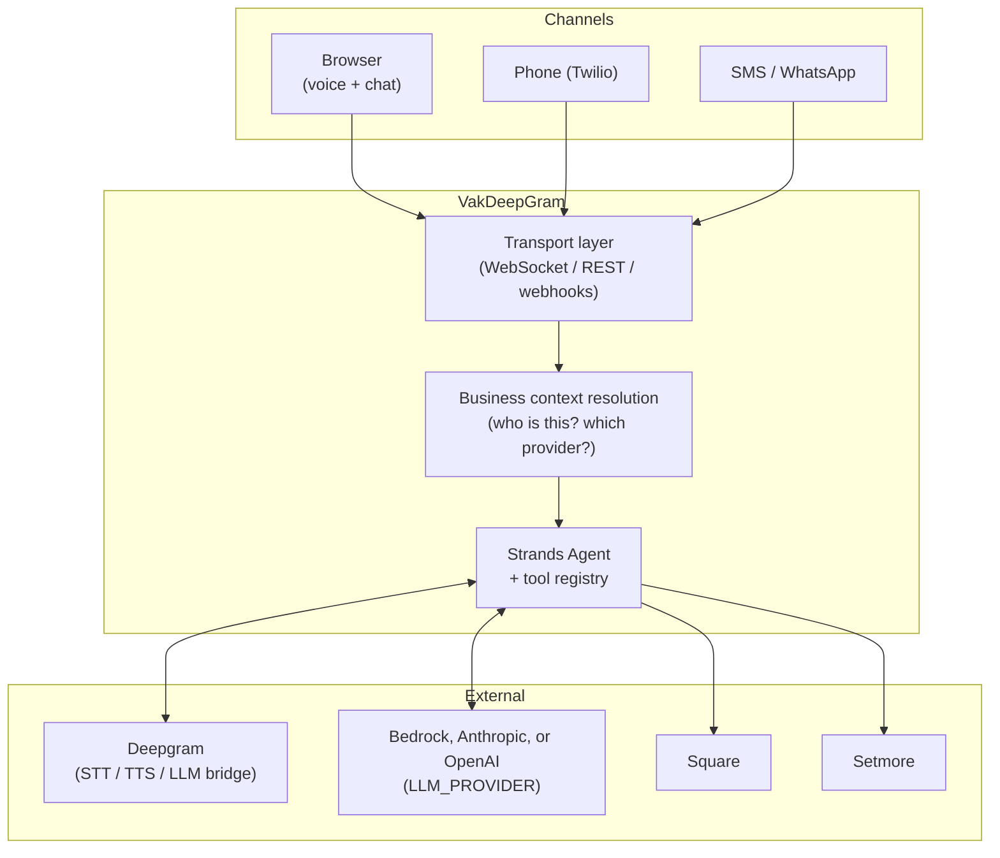

# Design

The reasoning behind Vak's architecture. For code-level structure, see
[ARCHITECTURE.md](./ARCHITECTURE.md).

## Problem

Small service businesses (barbers, salons, clinics, gyms, repair shops)
lose customers to unanswered calls and slow replies, but can't justify a
full-time receptionist or a bespoke IVR build. Vak gives them an AI
assistant that answers the phone, texts, and web chat the same way a good
front-desk person would — and that a developer can stand up, brand, and
deploy in an afternoon.

## Design goals

1. **One agent, every channel.** The same booking logic and business
   context should power a phone call, a browser conversation, an SMS
   thread, and a WhatsApp chat — not four separate implementations.
2. **Generic by default, specific by configuration.** The core product
   shouldn't assume any one industry. A barber shop and a dental clinic
   should both feel first-class, driven by settings rather than forked code
   (see [CUSTOMIZING_YOUR_AGENT.md](./CUSTOMIZING_YOUR_AGENT.md)).
3. **Swap booking backends without touching the agent.** Square and
   Setmore have different APIs and different capabilities (Setmore can't
   book directly; Square can). The agent's tool contract hides that
   difference as much as the underlying platforms allow.
4. **Deployable from zero.** No pre-existing AWS account setup, hosted
   zone, or companion dashboard should be required for a first deploy —
   see [DEPLOYMENT.md](./DEPLOYMENT.md).

## System overview

Every channel converges on the same context-resolution step and the same
agent + tool registry — a booking made over the phone is visible to a
customer texting the same business number a minute later, because both
paths resolve to the same business account and customer record.

## Key decisions

### Multi-tenancy by phone number

A single VakDeepGram deployment can serve many businesses. Incoming
connections (a call, a web session with a `businessNumber` param, an SMS)
are resolved to a specific business account by phone number
(`BusinessNumber` table → provider account → cached business context). This
is what makes local test mode possible too: with no matching record and
`OAUTH_ALLOW_LOCALHOST_NOAUTH=true`, VakDeepGram falls back to a mock
business instead of failing, so development doesn't require seeding real
data.

### Provider abstraction, not provider abstraction *theater*

Square and Setmore aren't just different APIs — they support genuinely
different operations (Setmore returns a booking link instead of creating
an appointment directly). Rather than force a lowest-common-denominator
interface that hides this, the agent's tool set and prompts differ exactly
where the providers differ, and are identical everywhere else. See
`providers/square/` vs `providers/setmore/` in
[ARCHITECTURE.md](./ARCHITECTURE.md#provider-abstraction).

### Persona as configuration, not a fork

Early versions of this project were hard-coded to one vertical. Generalizing
it meant identifying the one part of the system prompt that's actually
industry-specific (the opening role description and one example exchange)
and making everything else — the booking flow, tool usage rules, style
guidance — vertical-agnostic. See
[`providers/common/persona.py`](../VakDeepGram/providers/common/persona.py)
and [CUSTOMIZING_YOUR_AGENT.md](./CUSTOMIZING_YOUR_AGENT.md).

### Deployable from zero

VakInfra creates every resource it needs — VPC, ECR repo, ECS service, ALB,
DynamoDB tables, S3 bucket — rather than assuming any of them already
exist. Custom domains, TLS, WAF, and Cognito auth are additive: useful in
production, entirely optional for a first deploy or a demo environment.

## Trade-offs and future considerations

- **Multiple environments**: today, one `cdk deploy` = one environment.
  Running staging + production means deploying twice with different
  `-c stage=` values — there's no built-in promotion pipeline. That's a
  deliberate simplification; add one on top if your team needs it.
- **Connecting a real Square/Setmore account** is still a manual,
  per-business step (seeding DynamoDB records) rather than a self-serve
  OAuth flow in this repo — that's the job of a separate business-facing
  dashboard app, not the voice/chat runtime itself.
- **Voice authentication, richer analytics, and additional providers**
  (beyond Square/Setmore) are natural extensions but out of scope for the
  base kit.
