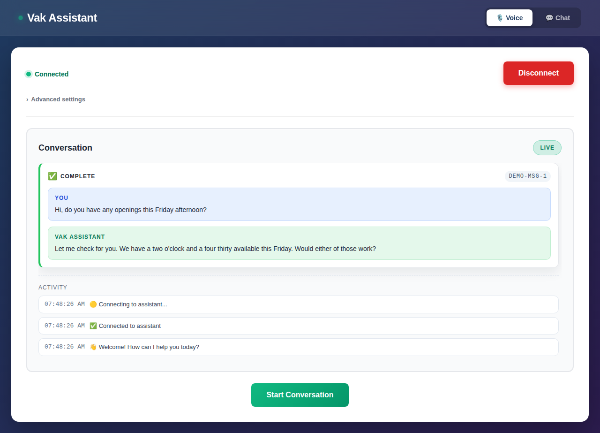

# Getting Started

This walks through going from a fresh clone to talking with your voice
agent in the browser, then (optionally) deploying it to AWS. Prefer a
shorter, more visual walkthrough? See
[TUTORIAL.md](./TUTORIAL.md) — "Your First Voice Agent in 10 Minutes."

## 1. Prerequisites

- [Node.js 20+](https://nodejs.org)
- [Python 3.8+](https://www.python.org/)
- A free [Deepgram API key](https://console.deepgram.com) — Deepgram powers
  speech-to-text, bridges to the LLM, and (optionally) text-to-speech
- Docker and the [AWS CLI](https://aws.amazon.com/cli/) — only needed later, for deployment

Run `./vak doctor` at any point to check what's installed and what's missing.

## 2. Run the setup wizard

```bash
./vak init
```

Every question has a default — press Enter to accept it and move on. Only
the Deepgram API key is actually required; everything else is optional and
gets a sensible default.

1. **Use case** (optional) — a name and, optionally, what kind of assistant
   this is (barber, salon, spa, medical, fitness, home services, or your own
   custom persona). Skip it entirely for a general-purpose assistant. This
   shapes the agent's system prompt — see
   [CUSTOMIZING_YOUR_AGENT.md](./CUSTOMIZING_YOUR_AGENT.md).
2. **AI model** — which provider powers conversation and tool use: AWS
   Bedrock/Claude (default, uses your AWS credentials, no key needed),
   Anthropic directly, or OpenAI directly.
3. **Voice** — your Deepgram API key (required — it always handles
   speech-to-text) and which text-to-speech voice to use: ElevenLabs
   (proxied through Deepgram, no separate account needed), Deepgram Aura, or
   any other provider Deepgram's Voice Agent API supports.
4. **Business data** — choose **local test mode** for your first run. It
   uses a mock business (fake hours, services, and staff) so you can hear
   the agent working immediately, with no Square/Setmore account required.
   Connecting a real account is a separate step — see
   [CONFIGURATION.md](./CONFIGURATION.md#connecting-a-real-square-or-setmore-account).
5. **Twilio** (optional) — skip this unless you're wiring up phone calls
   right now.
6. **Web client** — the WebSocket URL VakClient should connect to (defaults
   to your local backend).
7. **AWS** (optional) — skip this until you're ready to deploy; see
   [DEPLOYMENT.md](./DEPLOYMENT.md).

Re-running `./vak init` later only touches the keys you change — it won't
clobber other settings in your `.env` files.

## 3. Run it locally

```bash
./vak dev
```

The first run creates a Python virtualenv, installs backend dependencies,
and installs frontend `npm` dependencies — this can take a minute. Every
run after that starts instantly. You'll see:

```
Backend:  http://localhost:8080  (WebSocket at /ws)
Frontend: http://localhost:5173
```

Open [http://localhost:5173](http://localhost:5173):

1. Click **Connect**.
2. Click **Start Conversation**, allow microphone access, and talk.
3. Try something like *"What are your hours?"* or *"I'd like to book an
   appointment."*

The transcript and the agent's replies appear in the **Conversation**
panel as the call progresses:



### Trying the chat interface

Click **Chat** in the top navigation for a text-based interface to the same
agent — useful for quick testing without a microphone.

## 4. Make it yours

- Give it a real name and pick (or write) a persona: see
  [CUSTOMIZING_YOUR_AGENT.md](./CUSTOMIZING_YOUR_AGENT.md).
- Connect a real Square or Setmore account instead of local test mode: see
  [CONFIGURATION.md](./CONFIGURATION.md).
- Wire up phone calls, SMS, or WhatsApp via Twilio: see
  [VakDeepGram/README.md](../VakDeepGram/README.md).

## 5. Deploy to AWS

```bash
./vak deploy
```

See [DEPLOYMENT.md](./DEPLOYMENT.md) for the full walkthrough, including
custom domains and TLS.

## Troubleshooting

See [FAQ.md](./FAQ.md), or run `./vak doctor` to re-check your environment.
