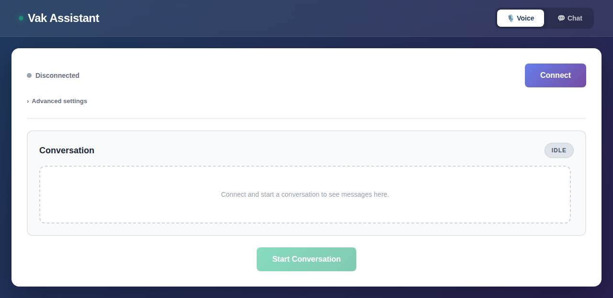
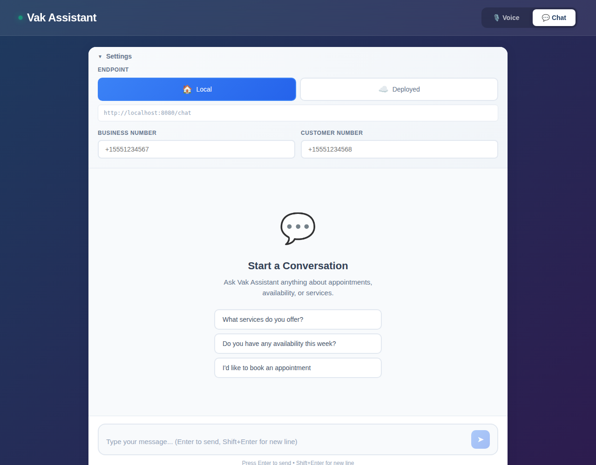
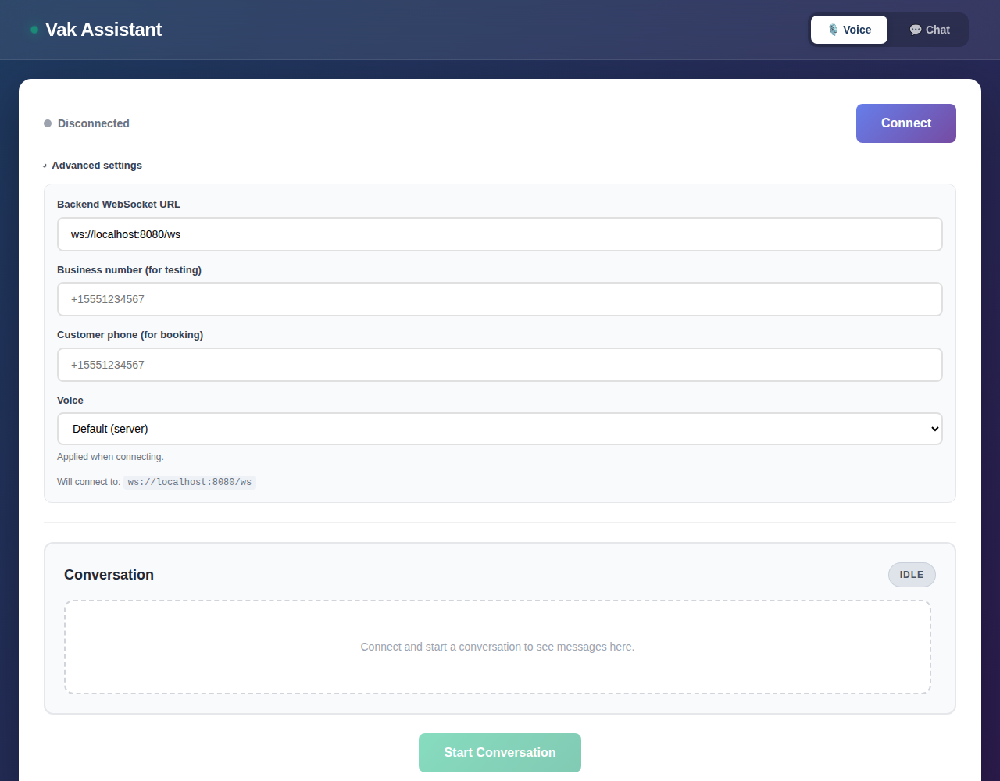

# Tutorial: Your First Voice Agent in 10 Minutes

A friendly, click-by-click walkthrough from a fresh clone to talking with
your own voice agent in the browser. No AWS account needed for this part —
that's a separate, later step (see [DEPLOYMENT.md](./DEPLOYMENT.md)).

What you need before starting:
- [Node.js 20+](https://nodejs.org) and [Python 3.8+](https://python.org)
- A free [Deepgram API key](https://console.deepgram.com) (sign up takes about a minute)

## Step 1 — Set up

From the repo root:

```bash
./vak init
```

This is a short interview. Every question has a default shown in
parentheses — press **Enter** to accept it and move on. If you just want to
kick the tires, you can press Enter through almost everything and only stop
to paste in your Deepgram API key.

A few things it'll ask, in order:

- **Use case** — optional. Leave it as "General assistant" for now, or pick
  a preset like "Barber shop" to see what a specialized persona sounds
  like. (You can change this later — see
  [CUSTOMIZING_YOUR_AGENT.md](./CUSTOMIZING_YOUR_AGENT.md).)
- **AI model** — leave this as **AWS Bedrock** if you have AWS credentials
  set up locally, or switch to **Anthropic** or **OpenAI** and paste in that
  key instead.
- **Voice** — paste your **Deepgram API key** here (this one's required).
  Leave the TTS voice as **ElevenLabs**, the default.
- **Business data** — leave this as **local test mode**. It gives your
  agent a fake business (hours, services, staff) to talk about, so you can
  hear it working right away without connecting a real Square or Setmore
  account.
- Everything after that (Twilio, the web client URL, AWS) is safe to skip
  for now — just keep pressing Enter.

When it finishes, you'll see:

```
Ready
  ./vak dev      Start the backend + web client locally
  ./vak deploy   Deploy to AWS when you're ready
  ./vak doctor   Re-check your environment any time
```

## Step 2 — Run it

```bash
./vak dev
```

The first run installs dependencies (a Python virtualenv for the backend,
`npm install` for the frontend), so it takes a minute. After that it starts
instantly. Once you see:

```
Backend:  http://localhost:8080  (WebSocket at /ws)
Frontend: http://localhost:5173
```

open [http://localhost:5173](http://localhost:5173) in your browser.

## Step 3 — Connect

You'll land on the voice page. Click **Connect**.



The status badge turns green and switches to **Connected**.

## Step 4 — Talk to it

Click **Start Conversation**, allow microphone access when your browser
asks, and say something like *"What are your hours?"* or *"I'd like to
book an appointment."* Your words and the agent's replies appear as they
happen:


*(Example conversation shown for illustration — yours will reflect
whatever business data and persona you configured.)*

Click **End Conversation** when you're done, or just start talking again —
barge-in works, so you can interrupt the agent mid-reply the same way
you'd interrupt a person.

## Step 5 — Try text chat too

Click **Chat** in the top navigation for a text-based interface to the
exact same agent and business data — handy for quick testing without a
microphone, or for a text-first support channel:



## Step 6 — Peek at the advanced settings

Back on the voice page, click **Advanced settings** to see (and override)
the WebSocket URL, test phone numbers, and voice selection — useful once
you're pointing the client at a deployed backend instead of localhost:



## What's next

- **Give it a name and a personality** — [CUSTOMIZING_YOUR_AGENT.md](./CUSTOMIZING_YOUR_AGENT.md)
  walks through picking a vertical preset or writing your own persona.
- **Connect a real Square or Setmore account** instead of local test mode —
  see [CONFIGURATION.md](./CONFIGURATION.md#connecting-a-real-square-or-setmore-account).
- **Wire up phone calls, SMS, or WhatsApp** via Twilio — see
  [VakDeepGram/README.md](../VakDeepGram/README.md).
- **Deploy to AWS** — `./vak deploy` and [DEPLOYMENT.md](./DEPLOYMENT.md).
- **Understand how it all fits together** — [ARCHITECTURE.md](./ARCHITECTURE.md)
  and [DESIGN.md](./DESIGN.md).

Stuck on something? Check [FAQ.md](./FAQ.md) or run `./vak doctor`.
